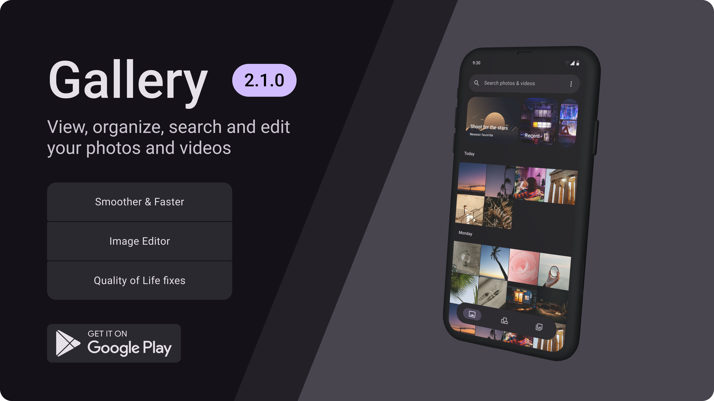

# Gallery
> An Android Gallery app built with Jetpack Compose.
> 
> The goal of this project is to create and bring the Gallery app everyone wants, with the features everyone needs. FOSS

## Download

## Support
- Translate the project using the link from above
- Donations:
    - Use the links on the right side of the repo (Sponsor me)
    - More options available in-app (Settings -> Donate)
## Frequent Questions
- Why Google Play version is 'Paid'?
    - It's just another way to support the project while getting back autmatic updates via Google Play
- Why Android 11 is the minimum version required?
    - Some Media features and APIs require Android 11 as a minimum version [Trash feature, most APIs used in the app]
- Will you support lower android versions?
    - While this is not a priority right now, I do have in mind to include support for lower Android versions at a cost of reduced features. If anyone volntueers to do so before me can request a pull request.
- Will you add [X] feature?
    - Please open a new feature request under 'Issues' tab and if the feature will be considered useful and possible can be added.

